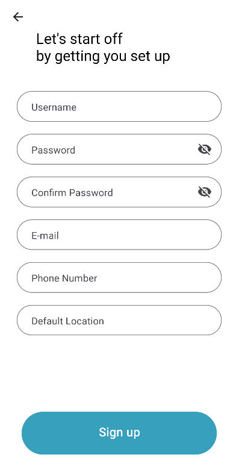
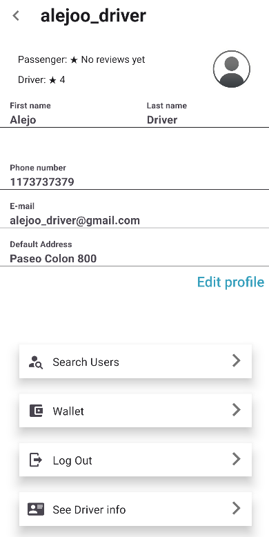

# FIUBER

---

### Verificar que expo este instalado

```bash
    expo --version
    6.0.5
```

Si no esta instalado. Instalarlo con el siguiente comando:

```bash
    npm i -g expo-cli
```

Luego verificar que la instalacion fue correcta con el comando de arriba.

---

### Verificar que node (y todos los modulos requeridos por la aplicacion) este instalado

Verificar que la version de **node** instalada sea correcta

```bash
    node --version
    >>> v18.0.0
```


```bash
    npm install
```

---

### Correr app con expo

Ejecutar el comando:

```bash

    expo start
```

Se va a imprimir por pantalla lo siguiente:

```bash
› Press a │ open Android
› Press w │ open web

› Press r │ reload app
› Press m │ toggle menu

› Press ? │ show all commands

Logs for your project will appear below. Press Ctrl+C to exit.
Started Metro Bundler
```

Para poder correrlo desde una maquina virtual de android. Tiene que estar ya corriendo la imagen. Para levantarla, usar android studio y crear una nueva imagen.

---
### Variables de entorno

Las variables de entorno se deben encontrar en un archivo *.env* en el directorio del proyecto. 
Las variables necesarias para este archivo se pueden encontrar en *eas.json* bajo *build.preview.env*

---
### Build de la App en expo

Para generar un .apk de la app, es necesario colocar las variables de entorno en *build.preview.env* y ejecutar el siguiente comando:

```bash
    eas build -p android --profile preview
```

Una vez finalizado este proceso, se puede descargar el .apk desde el link mostrado en la consola.

> Para poder correr este comando, es necesario tener un proyecto de expo asociado al proyecto.
> En caso de querer modificar el proyecto de expo actual, se puede modificar la variable *originalFullName* en **app.json**


---

### Lista de funcionalidades/features de la aplicacion:

- Registro de usuarios
    - Registro de pasajero
    
    
    
    - Registro de chofer (choferes pueden tambien actuar como pasajeros)
    
    
    
- Login de Usuarios
    - Login con e-mail y contraseña
    - Login federado (por medio de Google)
    
    
    
- Recupero de contraseña


- Homescreen


- Pantalla de perfil
    - Editar perfil
    
    
    
    - Visualizacion de perfil ajeno (a travez de username)
    
- Viajes
    - Pedir el inicio de un viaje desde un origen hasta un destino, previamente consultando la ruta y el costo del mismo
    
    
    
    - Pantalla de espera, una vez asignado un chofer, que permite visualizar el auto del chofer hasta que llegue a la locacion de origen
    
    
    
    - Visualizacion de locacion durante el viaje hasta termino del mismo, una vez finalizado el viaje se cobrara de la wallet asociada al usuario
    
- Trabajar como chofer
    - Visualizar los viajes actualmente disponibles para ser tomados
    
    
    
    - Tomar un viaje en particular, sabiendo antes datos varios del viaje (entre ellos la paga)
    - Viajar a la locacion origen del viaje, realizar el viaje y finalizarlo para luego poder cobrar la paga
    
    
    
- Wallet (administrada por la app, los fondos en la misma permiten el pago de los viajes en la aplicacion)
    - Depositar Ethereum en wallet
    - **(Drivers Only)** Extraer dinero ganado en una wallet determinada
    
- Calificaciones (cualitativas y cuantitativas)
    - De pasajeros a choferes
    - De choferes a pasajeros
    
    
    
- Push Notifications
    - Notificacion indicando que un determinado chofer fue asignado para el viaje comenzado por un pasajero
    - **(Drivers Only)** Notificacion indicando que un viaje nuevo esta disponible
